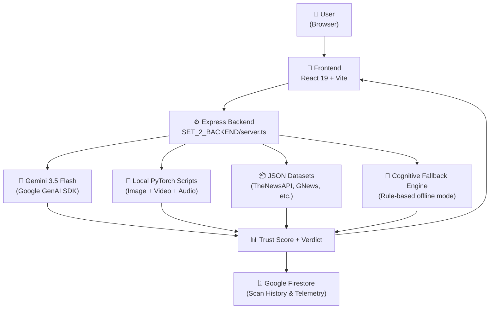
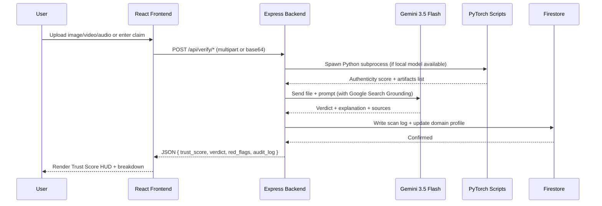

# 🔍 TruthLens v2 — Deep Technical Analysis

> **Repo**: [github.com/Studio-Ansh/Truthlensev2](https://github.com/Studio-Ansh/Truthlensev2)  
> **Live App**: [remix-remix-truthlensnew-688132236117.us-west1.run.app](https://remix-remix-truthlensnew-688132236117.us-west1.run.app/)  
> **Description**: AI-based multi-modal verification platform — analyze images, videos, audio, and news claims for authenticity.

---

## 🧭 What Is TruthLens v2?

TruthLens v2 is an **advanced, multi-modal neural verification platform** that lets users submit:
- 📸 **Images** → Deepfake / AI-generation detection
- 🎥 **Videos** → Temporal face-swap detection
- 🔊 **Audio** → Voice-clone / neural vocoder detection
- 📰 **Text / News claims** → Real-time fact verification

It returns a unified **Trust Score**, detailed breakdown logs, and an audit trail stored in Google Firestore.

---

## 🏗️ System Architecture



---

## 🤖 AI Models Used

### 1. 🖼️ Image Deepfake Detector — Hybrid CNN + Transformer
| Property | Detail |
|----------|--------|
| **Architecture** | Hybrid: **EfficientNet-B4** + **ViT (Vision Transformer)** |
| **Framework** | PyTorch |
| **Task** | Binary classification: `REAL` vs `FAKE` |
| **What It Detects** | Generative infills, diffusion boundary anomalies, lighting mismatches, edge-refraction artifacts |
| **Training Data** | Kaggle: `artifact-dataset`, `deepfake-and-real-images`, `real-and-fake-face-detection` |
| **Label Mapping** | `0 = REAL/ORIGINAL/AUTHENTIC` · `1 = FAKE/SYNTHETIC/MANIPULATED` |
| **Checkpoint Files** | `checkpoints/truthlens_efficientnet_epoch_N.pt` / `truthlens_vit_epoch_N.pt` |
| **Evaluation** | Accuracy, Precision, Recall, F1-score, Confusion Matrix (via `sklearn`) |

**Why EfficientNet-B4 + ViT together?**
- EfficientNet-B4 = excellent at local texture artifacts (compression, blurring, GAN seams)
- ViT = captures long-range spatial relationships (global lighting, facial symmetry)
- Together they cover both micro-level and macro-level manipulation signals

---

### 2. 🎥 Video Deepfake Detector — Spatio-Temporal Network
| Property | Detail |
|----------|--------|
| **Architecture** | **ResNeXt50 + Bi-LSTM** (Bidirectional LSTM) |
| **Framework** | PyTorch |
| **Task** | Frame-by-frame deepfake detection with temporal coherence tracking |
| **What It Detects** | Micro-expression inconsistencies, lip-sync misalignment, temporal jitter, face-swap artifacts across time |
| **Data** | `SET_2_BACKEND/video_model/` pipeline |

**Why ResNeXt50 + Bi-LSTM?**
- ResNeXt50 extracts per-frame spatial features (CNN backbone)
- Bi-LSTM processes them as a time sequence in both forward and backward directions — crucial for catching temporal inconsistencies in video deepfakes that CNN-only models miss

---

### 3. 🔊 Audio Deepfake Detector — Acoustic Fingerprinting
| Property | Detail |
|----------|--------|
| **What It Analyzes** | Voice pitch contours, spectral integrity, phase coherence |
| **Detects** | Voice-cloning networks, neural vocoder synthesis (e.g., WaveNet, HiFi-GAN outputs) |
| **Location** | Referenced in README; inference handled by backend pipeline |

---

### 4. 🤖 Gemini 3.5 Flash — LLM Orchestration Engine
| Property | Detail |
|----------|--------|
| **Model** | `gemini-3.5-flash` via `@google/genai` TypeScript SDK |
| **Role** | Primary AI for advanced visual forensics, fact-checking, and real-time grounding |
| **Features Used** | **Google Search Grounding** for live semantic context verification |
| **Fallback** | If API key absent or service down → local heuristic engine activates |
| **Retry Logic** | Exponential backoff (up to 2 retries with 1s/2s delays) |

---

### 5. 🧠 Cognitive Fallback Engine — Rule-Based Offline AI
When network/API is unavailable, a local heuristic engine activates:
- Keyword scoring for **extreme fabrication** (`conspiracy`, `hoax`, `secret cure`, `aliens landed`, etc.)
- **Clickbait detection** (`you won't believe`, `mind-blowing`, `gone viral`, etc.)
- **High-risk topic flags** (`miracle cure`, `rigged election without proof`, etc.)
- Returns: `credibility_score`, `verdict_label` (`Likely Real / Uncertain / Likely Fake`), `confidence_tier`

---

## 📰 News Verification Pipeline

Real-time fact-checking using **5 aggregated news datasets**:

```
Datasets (JSON, cached in memory):
├── TheNewsAPI dataset
├── Currents dataset
├── Mediastack dataset
├── GNews dataset
└── NewsData dataset
```

**How it works:**
1. User submits a claim/headline
2. **Step 1** — Exact/substring match against all 5 datasets (title + content)
3. **Step 2** — If no match, **Gemini 3.5 Flash with Google Search Grounding** dynamically evaluates it
4. **Step 3** — Domain risk profile updated in `monitored_domains.json`
5. **Step 4** — Result logged to **Firestore** with confidence %, verdict, and red flag list

---

## 🗄️ Data Storage (Google Firestore)

| Collection | Contents |
|------------|----------|
| User Sessions | Auth history, username mappings |
| Scan History | Verification records with confidence %, verdict, media type |
| Monitored Domains | Risk profiles per domain (avg authenticity, risk level, alert status) |
| Verified History | Full audit logs with backbone used, red flags, confidence tier |
| Weekly Reports | Aggregated telemetry by ISO week number |

---

## 🎨 Frontend Stack

| Layer | Technology |
|-------|-----------|
| **Framework** | React 19 + TypeScript (strict mode) |
| **Bundler** | Vite |
| **Styling** | Tailwind CSS v4 |
| **Animations** | Framer Motion v12 (`motion/react`) |
| **Icons** | Lucide React |
| **State** | App.tsx central HUD view-manager state machine |

**Key UI Components:**
- `TelemetryPlayground.tsx` — Live scanning telemetry dashboard
- `AIPipelineGraph.tsx` — Interactive canvas visualizing AI inference nodes
- `InteractivePhysicsLogo.tsx` — Physics-based animated logo
- `BackgroundGraphics.tsx` — Particle effect backgrounds
- `ThreeQuestionCards.tsx` — Submission interface (image / video / text)
- `LoginScreen.tsx` — Firebase Auth-powered login

---

## ⚙️ Backend Stack

| Layer | Technology |
|-------|-----------|
| **Runtime** | Node.js + Express |
| **Language** | TypeScript (executed via `tsx`) |
| **File Upload** | Multer (100MB memory buffer) |
| **AI SDK** | `@google/genai` v2.4+ |
| **ML Inference** | Python 3.10+ subprocess calls (`child_process.exec`) |
| **ML Framework** | PyTorch (EfficientNet, ViT, ResNeXt50, Bi-LSTM) |
| **Build** | esbuild → single `dist/server.cjs` |

---

## 🔒 Security Design

| Mechanism | Detail |
|-----------|--------|
| **API Key Isolation** | All Gemini/Firebase keys stay server-side in `server.ts`. Client only calls `/api/*` routes |
| **File Upload Safety** | Multer restricts to 100MB; files stored in memory only (no disk write) |
| **Firestore Rules** | Per-user read/write isolation via `firestore.rules` |
| **Git Safety** | `.gitignore` excludes `*.pt` model weights and `.env` secrets |
| **Vercel Safety** | `.vercelignore` prevents ML weight files from entering production build |

---

## 🚀 Deployment

| Target | Method |
|--------|--------|
| **Cloud Run** | Live at `us-west1.run.app` |
| **Vercel** | `vercel.json` config for serverless routes |
| **Dev** | `npm run dev` — tsx backend + Vite HMR on Port 3000 |
| **Build** | `npm run build` — Vite frontend + esbuild backend → `dist/` |
| **Start** | `npm run start` — runs compiled `dist/server.cjs` |

---

## 🔄 End-to-End Data Flow



---

## 📊 Codebase Stats

| Metric | Value |
|--------|-------|
| **Total Commits** | 7 |
| **Language** | TypeScript 66.5% · Python 30% · CSS 3.2% · HTML 0.3% |
| **Structure Sets** | 4 (Frontend / Backend / Deploy Config / Git Ignores) |
| **Key Files** | `server.ts`, `train.py`, `evaluate.py`, `App.tsx` |
| **AI Models** | 4 (EfficientNetB4, ViT, ResNeXt50+BiLSTM, Gemini Flash) |
| **News APIs** | 5 (TheNewsAPI, Currents, Mediastack, GNews, NewsData) |

> [!NOTE]
> The PyTorch model weights (`.pt` files) are excluded from the repo via `.gitignore`. You need to run `train.py` against a real dataset (FaceForensics++, DFDC, Celeb-DF v2) to generate them locally before the local inference scripts work. Gemini API works out-of-the-box with just an API key.

> [!TIP]
> The platform has a smart **dual-mode** design: when Gemini API key is set, it uses full LLM-powered analysis. When offline or key is missing, the local heuristic fallback engine activates automatically — making it resilient.
