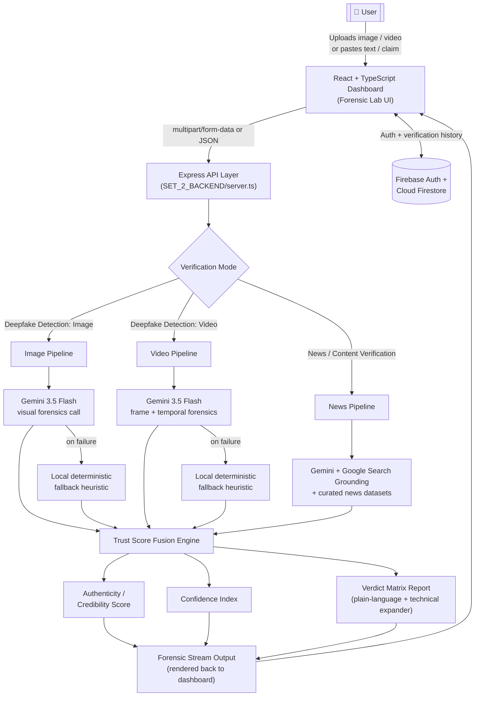

# [ TRUTHLENS ]

**Next-Gen Cognitive Forensics — Deciphering Truth in Synthetic Media**

TruthLens is a multi-modal AI verification platform that detects deepfakes in images and videos, and fact-checks news and text claims in real time — all through a single dark, terminal-styled forensics dashboard.


---

## 📑 Table of Contents

1. [Project Overview](#-project-overview)
2. [Problem Statement](#-problem-statement)
3. [Solution](#-solution)
4. [Features](#-features)
5. [Technology Stack](#-technology-stack)
6. [Architecture & Workflow](#-architecture--workflow)
7. [Installation & Setup](#-installation--setup)
8. [Usage Guide](#-usage-guide)
9. [Team](#-team)

---

## 🌐 Project Overview

**TruthLens** is a full-stack deepfake and misinformation detection platform built to answer one question in real time: *"Can I trust what I'm looking at?"*

It ships with two verification modes behind a single toggle:

- **Deepfake Detection** — upload an image or video and get a frame-level / pixel-level authenticity verdict.
- **News / Content Verification** — paste a headline, claim, or article and get a real-time, search-grounded credibility verdict.

Both modes feed into a shared **Trust Score Fusion Engine** and render through the same amber-on-black, monospace "forensic terminal" dashboard — built to feel like a command center, not a toy.

---

## ❗ Problem Statement

Generative AI has made synthetic media — fake faces, face-swapped videos, cloned voices, and fabricated news — cheap to produce and difficult to tell apart from the real thing. This creates real damage:

- **Deepfakes** are used for fraud, non-consensual content, political disinformation, and KYC/identity-verification bypass.
- **Fabricated news and claims** spread faster than fact-checks and are often written to *look* credible (alarmist language, fake citations, doctored screenshots).
- **Existing tools are fragmented** — a user needs one tool to check an image, another for video, and a manual search to fact-check text — and most surface a raw "confidence score" with no explanation a non-technical person can act on.
- **Silent failure is common.** Many detection demos quietly fall back to placeholder or randomized scores when a model/API call fails, without telling the user — which is arguably worse than no tool at all.

## 💡 Solution

TruthLens consolidates deepfake forensics and content verification into **one platform with one trust model**:

- A **hybrid image pipeline** (EfficientNet-B4 + ViT) and a **temporal video pipeline** (ResNeXt50 + Bi-LSTM) analyze visual media for generative artifacts, lighting/edge inconsistencies, and frame-to-frame flicker.
- A **Gemini-grounded news pipeline** cross-references claims against live Google Search results and curated news datasets to catch fabricated or misleading claims.
- Every result is translated from raw model output into a **plain-English verdict** first, with a **collapsible technical breakdown** underneath for anyone who wants the raw evidence (bounding boxes, timestamps, sources checked, claims identified).
- Every score is labeled with **where it came from** (live model vs. fallback heuristic) so the platform never silently pretends a heuristic guess is a live neural verdict.

---

## ✨ Features

### 🕵️ Deepfake Detection Mode
- Drag-and-drop or file-browser upload for images, video, and audio (JPEG, PNG, MP4, MOV, MP3, WAV — up to 100MB).
- Scripted demo samples (with pre-tagged risk levels) for instant, no-upload demos.
- **Authenticity Score** card — large, bold real/fake percentage, colored **red for fake** and **green for real**.
- **Confidence Index** card — a three-tier (High / Medium / Low) confidence rating with its **own independent color coding**, so users never confuse "how fake" with "how sure," plus a plain-English explanation of the confidence tier.
- **Analysis Result visualization** — overlaid bounding boxes on suspicious image regions and timestamped findings on video, with graceful degradation to a text-only verdict if the localization pass fails.
- **Forensic Stream Output** — a live, terminal-style log that narrates the scan in short, plain-English lines instead of raw model/technical jargon.
- **Verdict Matrix Report** — a one-to-two sentence, human-readable verdict up top, with a **"[+ Show Technical Analysis]"** expander revealing the full forensic breakdown underneath.
- Risk tagging across the UI: `LOW`, `MEDIUM`, `HIGH`, `CRITICAL`.

### 📰 News / Content Verification Mode
- Paste-text input **or** upload a file (headline, claim, or article).
- Cross-references submissions against curated datasets (TheNewsAPI, Currents, Mediastack, GNews, NewsData) plus live **Gemini + Google Search grounding**.
- **Credibility Score** card (real vs. fake framing, consistent with the deepfake mode) and a matching **Verdict Confidence** card.
- Technical breakdown includes **claims identified** in the text and a **source-by-source check** (✓ supports / ✗ contradicts).
- Domain monitoring: flags, tracks, and lets operators dismiss newly identified low-credibility/high-risk sources, with auto-generated weekly misinformation trend reports.

### 🖥️ Dashboard & Experience
- Distinctive dark, terminal-inspired UI: black background, amber/red accent palette, monospace type, `ALL_CAPS_WITH_UNDERSCORES` panel headers (`FORENSIC_STREAM_OUTPUT`, `VERDICT_MATRIX_REPORT`, etc.).
- Interactive physics-driven logo, animated background graphics, and a custom cursor, built with Framer Motion.
- **AI Pipeline Visualizer** — an interactive node graph of the inference pipeline (ingestion → inference → fusion → verdict).
- Fully responsive telemetry dashboard ("Forensic Lab") with a live API-connection indicator.

### 🔐 Accounts, History & Reliability
- Firebase Authentication — email/password sign-up/sign-in plus **Google OAuth**.
- Per-operator verification history persisted to **Cloud Firestore** (scores, risk categories, timestamps, report links).
- Firestore security rules isolating each user's data.
- `/api/health` endpoint reporting live model/backbone status.
- Explicit, disclosed fallback: if the live Gemini forensics call fails, the API returns a clearly-labeled local heuristic result rather than silently faking a "live" score, and logs the real error server-side instead of failing silently.

---

## 🛠️ Technology Stack

| Layer | Technology |
|---|---|
| **Frontend Framework** | React 19 + TypeScript, Vite 6 |
| **Styling** | Tailwind CSS v4 |
| **Animation** | Framer Motion (`motion/react`) v12 |
| **Icons** | Lucide React |
| **Backend Runtime** | Node.js + Express 4, executed via `tsx` |
| **File Handling** | Multer (100MB in-memory upload limit) |
| **Production Build** | esbuild (bundles `SET_2_BACKEND/server.ts` → `dist/server.cjs`), Vite (static assets) |
| **Generative AI** | Google Gemini (`gemini-3.5-flash`) via the `@google/genai` SDK, with Google Search grounding |
| **Deepfake ML — Images** | PyTorch, EfficientNet-B4 & Vision Transformer (ViT-Base-Patch16) hybrid classifier |
| **Deepfake ML — Video** | PyTorch, ResNeXt50 (spatial backbone) + Bidirectional LSTM (temporal analysis) |
| **ML Tooling** | torchvision, OpenCV, scikit-learn, NumPy, pandas |
| **Database** | Google Cloud Firestore (NoSQL) |
| **Authentication** | Firebase Authentication (Email/Password + Google OAuth) |
| **Deployment** | Vercel (serverless function wrapping the Express app) / Node server |
| **Reference Datasets** | FaceForensics++, DFDC *(image/video model training)*; TheNewsAPI, Currents, Mediastack, GNews, NewsData *(news verification)* |
| **Primary Dev Workflow** | Google AI Studio **Build mode** for iterative scaffolding and prompt-driven code changes |

---

## 🏗️ Architecture & Workflow



**Offline ML training track** (independent of the live API path above): `SET_2_BACKEND/image_model/` and `SET_2_BACKEND/video_model/` contain standalone PyTorch training pipelines (`train.py`, `evaluate.py`, `verify_image.py`, `verify_video.py`) for the EfficientNet-B4 / ViT and ResNeXt50 + Bi-LSTM backbones. These are trained/evaluated against Kaggle datasets (FaceForensics++, DFDC, and similar) and are designed to be swapped in as the production inference backbone in place of, or alongside, the live Gemini calls.

### Repository Structure

```
truthlens/
├── api/                          # ⚠️ Vercel serverless entry point — MUST live at project root
│   └── index.ts                  #    (imports SET_2_BACKEND/server.ts)
│
├── SET_1_FRONTEND/                # [SET 1] React + TypeScript UI
│   └── src/
│       ├── App.tsx                # Primary view controller, theme layout & routing
│       ├── main.tsx               # Vite entrypoint & render mount
│       ├── index.css              # Tailwind v4 variables & custom animations
│       ├── components/            # Interactive HUD widgets & visualizers
│       │   ├── TelemetryPlayground.tsx
│       │   ├── LoginScreen.tsx
│       │   ├── InteractivePhysicsLogo.tsx
│       │   ├── BackgroundGraphics.tsx
│       │   ├── AIPipelineGraph.tsx
│       │   └── ThreeQuestionCards.tsx
│       └── lib/
│           ├── api.ts             # Frontend API client
│           └── firebase.ts        # Client-side Firebase/Firestore init
│
├── SET_2_BACKEND/                 # [SET 2] Express API + ML pipelines
│   ├── server.ts                  # Centralized API router, Gemini orchestration, fusion logic
│   ├── api/index.ts                # (superseded copy — real one must be at root, see above)
│   ├── data/datasets/              # Curated news datasets, monitored domains, verification history
│   ├── image_model/                # Standalone image deepfake ML pipeline (train/evaluate/verify + weights)
│   ├── video_model/                # Standalone video deepfake ML pipeline (train/evaluate/verify + weights)
│   ├── models/                     # PyTorch model weight registries
│   ├── train.py / evaluate.py      # Model training & evaluation harnesses
│   ├── firestore.rules             # Firestore security rules
│   └── firebase-applet-config.json # Firebase client config
│
├── index.html                     # References /SET_1_FRONTEND/src/main.tsx
├── vite.config.ts
├── vercel.json                    # Deployment + rewrite rules
├── .vercelignore                  # Excludes ML dirs from the serverless bundle
└── package.json
```

> **Note on the split:** the codebase is organized into logical sets (`SET_1_FRONTEND`, `SET_2_BACKEND`) for clarity, but Vercel's zero-config Functions feature only auto-detects an `/api` folder at the **project root** — so `api/index.ts` must stay at the root even though the server logic it wraps lives in `SET_2_BACKEND/`.

---

## 🚀 Installation & Setup

### Prerequisites
- **Node.js** v18 or higher
- **npm** v9 or higher
- **Python** 3.10+ *(optional — only needed to train/evaluate/run the local PyTorch models)*
- A **Google Gemini API key**
- A **Firebase project** (Authentication + Firestore enabled)

### 1. Clone the repository
```bash
git clone https://github.com/Studio-Ansh/Truthlense.git
cd Truthlense
```

### 2. Install frontend & backend dependencies
```bash
npm install
```

### 3. (Optional) Install ML dependencies
Only required if you plan to train or run the local PyTorch detectors directly:
```bash
pip install -r SET_2_BACKEND/video_model/requirements.txt
# torch, torchvision, torchaudio, opencv-python, numpy, kaggle
```

### 4. Configure environment variables
Copy the example file and add your keys:
```bash
cp .env.example .env
```
```env
GEMINI_API_KEY="your_gemini_api_key_here"
APP_URL="http://localhost:3000"
```

### 5. Configure Firebase
Ensure `SET_2_BACKEND/firebase-applet-config.json` (and the copy referenced by the frontend) contains your Firebase project's web config:
```json
{
  "projectId": "your-project-id",
  "appId": "your-app-id",
  "apiKey": "your-firebase-api-key",
  "authDomain": "your-project-id.firebaseapp.com",
  "firestoreDatabaseId": "(default)",
  "storageBucket": "your-project-id.firebasestorage.app",
  "messagingSenderId": "your-sender-id"
}
```
Deploy the included Firestore security rules:
```bash
firebase deploy --only firestore:rules
```

### 6. Run the app locally
```bash
npm run dev
```
This runs `tsx SET_2_BACKEND/server.ts`, starting the Express backend (Port `3000`) with Vite-powered hot-reloaded frontend assets.

### 7. Build & run for production
```bash
npm run build   # Bundles SET_2_BACKEND/server.ts -> dist/server.cjs and builds frontend static assets
npm run start   # Runs the compiled production server
```

### 8. Deploying to Vercel
1. Make sure `api/index.ts` exists **at the project root** (not only inside `SET_2_BACKEND/`) and imports the backend as `import app from "../SET_2_BACKEND/server";`.
2. In your Vercel project, add these under **Settings → Environment Variables** (Production + Preview): `GEMINI_API_KEY`, `FIREBASE_API_KEY`, `VITE_FIREBASE_API_KEY`.
3. Redeploy, then check **Deployments → Functions → api/index.ts → Logs** if `/api/health` doesn't come back online.

### 9. Type-check / lint
```bash
npm run lint
```

---

## 📖 Usage Guide

### Verifying an image or video
1. Sign in (email/password or Google) from the landing page.
2. Scroll to the **Forensic Lab** panel and make sure **`[ DEEPFAKE_DETECTION ]`** is selected.
3. Drag and drop a file (or click **browse local disk**) — JPEG, PNG, MP4, MOV, MP3, or WAV, up to 100MB. Alternatively, click one of the **scripted demo samples** to see a pre-scored example instantly.
4. Watch the **Forensic Stream Output** narrate the scan in real time.
5. Read the result:
   - **Authenticity Score** — the headline real/fake percentage.
   - **Verdict Confidence** — how sure the system is, independent of the score itself.
   - **Verdict Matrix Report** — a plain-language summary; click **`[+ Show Technical Analysis]`** for the full forensic breakdown (backbone used, bounding boxes/timestamps, risk tier).

### Verifying a news claim or article
1. Switch the toggle to **`[ NEWS_VERIFICATION ]`**.
2. Paste a headline, claim, or article body — or attach a text file.
3. Click **Analyze**.
4. Read the **Credibility Score**, **Verdict Confidence**, and the plain-language verdict; expand **Show Technical Analysis** to see the specific claims identified and which sources supported or contradicted each one.

### Checking system status
- `GET /api/health` — returns model load status and active backbones.
- The dashboard header shows a live **Verification API connected / offline** indicator.

### Key API Endpoints

| Method | Endpoint | Purpose |
|---|---|---|
| `GET` | `/api/health` | Model/backbone status check |
| `POST` | `/api/verify/image` | Run deepfake forensics on an image |
| `POST` | `/api/verify/video` | Run deepfake forensics on a video |
| `POST` | `/api/verify/audio` | Run voice/audio authenticity check |
| `POST` | `/api/verify/trust-score` | Compute fused trust score from raw model outputs |
| `POST` | `/api/verify-content` | Unified verification entry point (file or text) |
| `GET` | `/api/news` | Query curated news datasets |
| `POST` | `/api/analyze` | Run news/claim verification (Gemini + Search grounding) |
| `POST` | `/api/fetch-live` | Pull live source content for cross-referencing |
| `GET` / `POST` | `/api/monitored-domains` | List / flag monitored low-credibility domains |
| `POST` | `/api/monitored-domains/dismiss` | Dismiss a flagged domain |
| `GET` / `POST` | `/api/weekly-reports` | Fetch / generate weekly misinformation trend reports |
| `POST` | `/api/third-party-verify` | Cross-check against third-party verification sources |

### Training / evaluating the ML models directly
```bash
# Train
python SET_2_BACKEND/train.py
python SET_2_BACKEND/video_model/model/train.py

# Evaluate
python SET_2_BACKEND/evaluate.py

# Run standalone CLI verification
python SET_2_BACKEND/video_model/verify_video.py --video path/to/file.mp4 --report forensic_report.json
```
> Note: the bundled model checkpoints are currently smoke-tested on simulated data only. Train on a real labeled dataset (e.g. FaceForensics++ or DFDC) before relying on the local pipeline for production-grade accuracy.

---

## 👥 Team

| Name | Role | Contact |
|---|---|---|
| *Ansh Shrivastava* | Project Lead / Full-Stack & ML Development | *www.linkedin.com/in/ansh-shrivastava-0ba99032b* |
| *Aparna Shukla* | Full-Stack | *www.linkedin.com/in/aparna-shukla-028247361/* |
| *Mahak Shrivastava* | ML Development & Database | *www.linkedin.com/in/mahak-shrivastava-20b77433a/* |
| *Nandini Wani* | Backend & Deployment | *www.linkedin.com/in/nandini-wani-084b503a0/* |


---

<p align="center"><i>Engineered for the TruthLens Open Media Initiative.</i></p>
